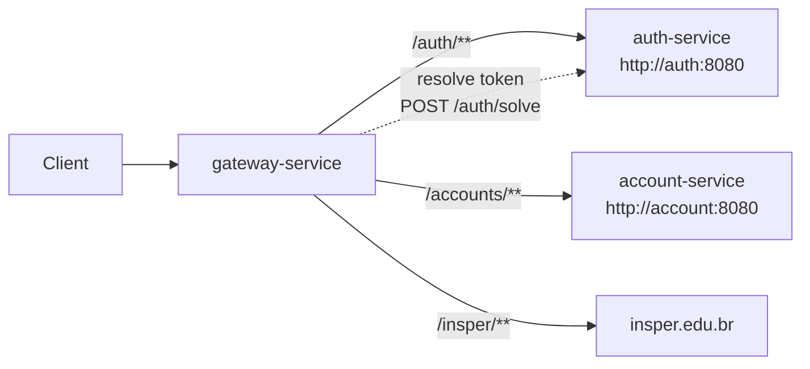
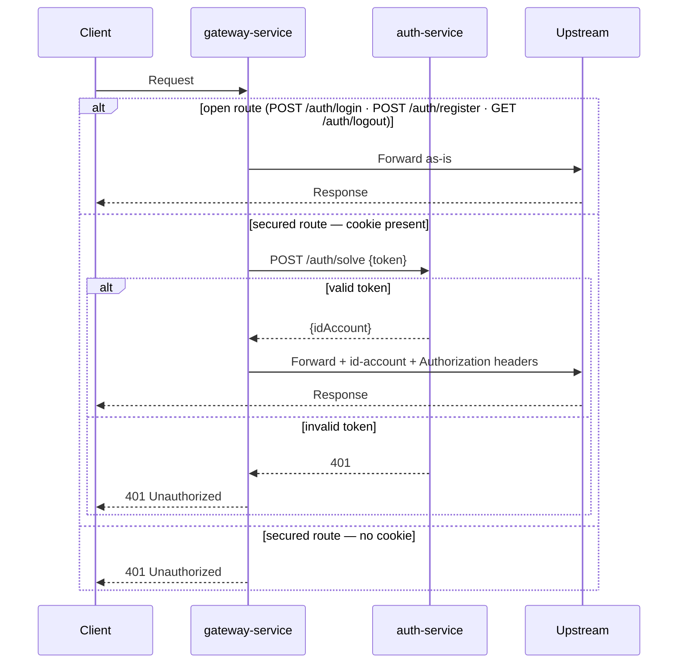

# pma.261.gateway-service

Spring Cloud Gateway (reactive) that is the single entry point for all client traffic. It handles CORS, route proxying, and JWT-based authorization before forwarding requests to downstream services.

## Overview

Every request from the frontend goes through the gateway. The gateway checks for a valid JWT cookie on protected routes, resolves the token against `auth-service`, and injects account identity headers before forwarding the request upstream.



## Stack

| Layer | Technology |
|---|---|
| Language | Java 25 |
| Framework | Spring Boot 4.x + Spring Cloud Gateway (WebFlux) |

## Routes

| ID | Incoming path | Upstream |
|---|---|---|
| `auth` | `/auth/**` | `http://auth:8080` |
| `accounts` | `/accounts/**` | `http://account:8080` |
| `insper` | `/insper/**` | `https://www.insper.edu.br` |

## Authorization Filter

A `GlobalFilter` (`AuthorizationFilter`) runs on every request:



On a valid token the following headers are injected into the forwarded request:
- `id-account: <uuid>` — account ID extracted from the JWT
- `Authorization: Bearer <jwt>` — the original token

### Open (unauthenticated) routes

| Method | Path |
|---|---|
| `POST` | `/auth/login` |
| `POST` | `/auth/register` |
| `GET` | `/auth/logout` |

All other routes require a valid `__store_jwt_token` cookie.

## Gateway-level endpoints

| Method | Path | Description |
|---|---|---|
| `GET` | `/` | Returns `"Store API"` — basic reachability check |
| `GET` | `/health-check` | Liveness probe, returns `200 OK` |

## CORS

Configured globally for all routes (`/**`) via environment variables:

| Variable | Description |
|---|---|
| `CORS_ALLOWED_ORIGINS` | Comma-separated list of allowed origins (e.g. `https://app.example.com`) |
| `CORS_ALLOWED_CREDENTIALS` | `true` / `false` — must be `true` when cookies are used |

All headers and methods are allowed (`"*"`).

## Configuration (`application.yaml`)

```yaml
spring:
  cloud:
    gateway:
      server:
        webflux:
          globalcors:
            corsConfigurations:
              '[/**]':
                allowedOrigins: ${CORS_ALLOWED_ORIGINS}
                allowedHeaders: "*"
                allowedMethods: "*"
                allowCredentials: ${CORS_ALLOWED_CREDENTIALS}
          routes:
            - id: auth
              uri: http://auth:8080
              predicates:
                - Path=/auth/**
            - id: accounts
              uri: http://account:8080
              predicates:
                - Path=/accounts/**
            - id: insper
              uri: https://www.insper.edu.br
              predicates:
                - Path=/insper/**
```

## Build & Run

```bash
mvn clean package
java -jar target/gateway-1.0.0.jar
```

Or via Docker Compose (service name: `gateway`).
